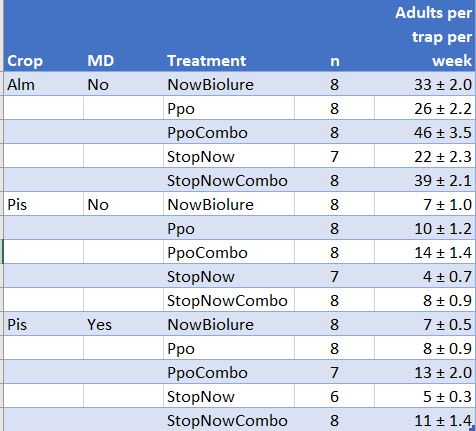
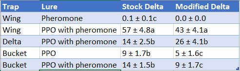
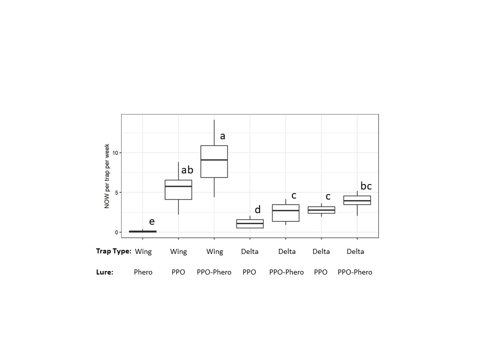

# Developing lures for monitoring navel orangeworm in the presence of mating disruption

File: y19-ppo-ms-overview.md

NB. Files referenced below are found in https://github/chuckbv/Y18_abc_lures

## Sections

 
## Elements (Tables and Figures)

### Table 1. Experiments

### Figure 1. Trap types including modified delta trap

### Table 2. Statistics for the experiments 

### Figure 2. Adults per week in disrupted and non-disrupted almonds and pistachios in 2017

### Table 2. Adults per week three sites in spring spring 2018 

### Table 3. Comparison of PPO in bucket and sticky traps

### Figure 3. Comparison of modified and unmodified sticky traps

### Table 4. Sex ratio in PPO and kairomone traps